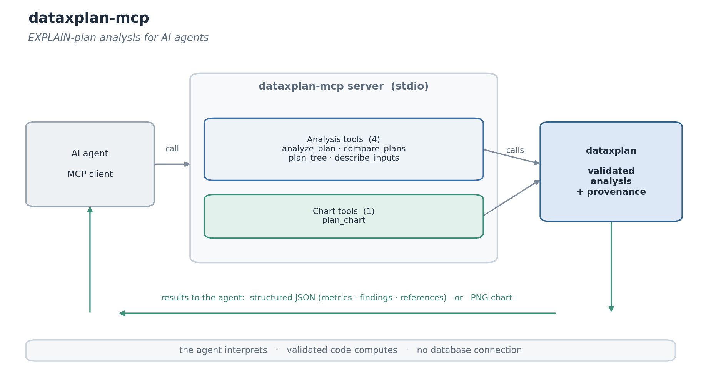

<!-- mcp-name: io.github.arikanatakan/dataxplan-mcp -->

# dataxplan-mcp

[](https://github.com/arikanatakan/dataxplan-mcp/actions/workflows/ci.yml)
[](https://pypi.org/project/dataxplan-mcp/)
[](LICENSE)

An MCP server that exposes [dataxplan](https://github.com/arikanatakan/dataxplan),
the PostgreSQL EXPLAIN-plan analyzer for Python, as tools for AI agents: give it
the output of `EXPLAIN (ANALYZE, BUFFERS, FORMAT JSON)` and it returns the
bottlenecks, the estimation errors, documented findings with a suggested action
and a source reference, a regression comparison, and a self-time chart.

Agents asked why a query is slow tend to eyeball the plan and get it wrong: self
time is per loop and inclusive of children, so the slow node is rarely the
obvious one, and a row mis-estimate (the usual root cause) is buried in the
output. Reading the plan belongs in a deterministic, versioned library that the
agent calls, which leaves the agent to interpret the result and decide. The
server never connects to a database: the agent runs EXPLAIN and passes the
output, so nothing leaves its environment.



## Tools

**Analysis tools** return dataxplan's payload: the metrics, the findings (each
with a severity, a suggestion and a documented source reference) and a summary.

| Tool | Purpose |
| ---- | ------- |
| `analyze_plan` | bottlenecks, estimation errors and findings from an EXPLAIN plan (JSON, text, YAML or XML) |
| `compare_plans` | compare two plans for regression (timing, shape, estimates, findings) |
| `plan_tree` | the plan as an annotated text tree (self time, rows, flags per node) |
| `describe_inputs` | how to produce the plan, the accepted formats, the findings and the thresholds |

**Chart tools** return a PNG image.

| Tool | Purpose |
| ---- | ------- |
| `plan_chart` | self time per node, with the high-severity findings highlighted |

All tools are read-only, and the server makes no database connection.

## Installation

Run it with [uv](https://docs.astral.sh/uv/) (no install needed):

```
uvx dataxplan-mcp
```

or install from PyPI:

```
pip install dataxplan-mcp
```

## Configuration

Add it to your MCP client. For example:

```json
{
  "mcpServers": {
    "dataxplan": {
      "command": "uvx",
      "args": ["dataxplan-mcp"]
    }
  }
}
```

If you installed with pip, use `"command": "dataxplan-mcp"` with no args.

## Example

```
analyze_plan(plan="<EXPLAIN (ANALYZE, BUFFERS, FORMAT JSON) output>")
  -> { "summary_metrics": { "execution_time_ms": 1240.0,
                            "max_estimation_error": 20000, ... },
       "findings": [ { "id": "seq_scan_hot", "severity": "high",
                       "detail": "... 95% of execution time ...",
                       "suggestion": "consider an index ...",
                       "reference": "PostgreSQL: Using EXPLAIN; the Indexes chapter" } ],
       "summary": "dataxplan - ...\n  execution time ..." }
```

The agent runs the EXPLAIN itself and pastes the output (any format) as `plan`.

## Design

The server is a thin, stateless wrapper. All of the analysis lives in the
dataxplan library, which computes the metrics from the documented EXPLAIN fields
and grounds each finding in the PostgreSQL manual (and Leis et al. 2015 for the
estimation rules). The server adds the tool schema, read-only annotations and an
input-schema helper so an agent can format the input and act on the result. The
findings are documented heuristics, not guarantees, and the server connects to
nothing.

## Related

- [dataxplan](https://github.com/arikanatakan/dataxplan): the library this server
  wraps.

## License

MIT. Written and maintained by [Atakan Arikan](https://github.com/arikanatakan),
MSc Student at Tsinghua University and Politecnico di Milano.
